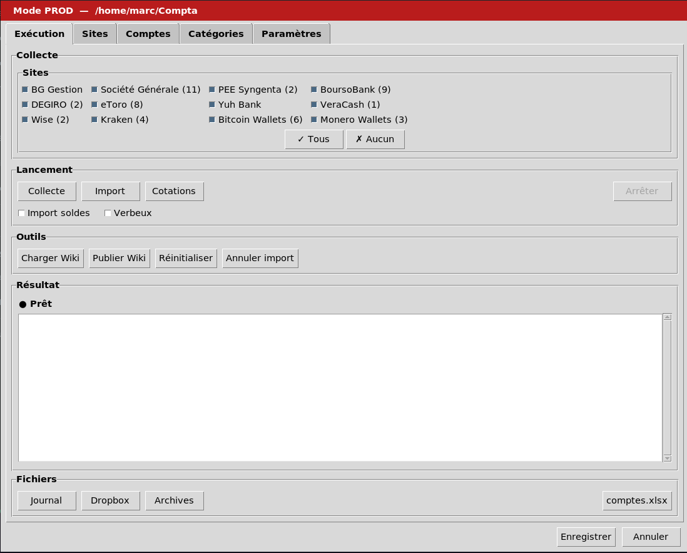

# 1. Présentation

Voir **README.md** pour la présentation du projet, l’installation et l’utilisation.

# 2. Introduction

La gestion comptable a pour but de centraliser dans un tableur :

* les **opérations** (ou transactions) financières

* les **positions** (ou valorisations ou balances ou soldes) de titres et comptes.

* les autres **valeurs de biens matériels** (immobilier ...)

Le tableur **comptes.xlsm** est partagé sur le Wiki. Il présente ces données et les synthétise selon différentes vues : postes budgétaires, plus values latentes, répartitions patrimoniales. Il détecte aussi des incohérences telles que des écarts entre  soldes calculés et soldes relevés.

Les tâches de la gestion comptable :

* **collecte** des données financières depuis les **sites** Internet
* saisie **manuelle** des opérations pour lesquelles il n'existe pas de site de rattachement (créances, achat bijoux ...)
* **importation** des données collectées dans le tableur.
* affectation des opérations à des **catégories** prédéfinies, elle même regroupées en **postes** budgétaires
* **appariement** d'opérations liées dans des comptes différents
* mise à jour des **cotations** monétaires pour la valorisation des biens
* **configuration** du tableur (Ajout / modification / suppression de Comptes, devises, titres, catégories, postes ...)

# 3. App d'assistance

L'App graphique **Comptabilité [PROD]** : 

- automatise la quasi totalité de ces tâches
- dispense de connaissances Excel pour la configuration
- conserve les données Excel qui sont hors de son périmètre

L'App peut générer automatiquement des opérations (ex : crédit espèces en contrepartie d'un retrait DAB).

Une présence est nécessaire au moment de la collecte lorsque les procédures 2FA (Two Factor Authentication) sont déclenchées. Ces procédures sont inexistantes, occasionnelles ou systématiques, selon les sites.

Une supervision reste nécessaire ; par exemple pour compléter la catégorisation ou pour relancer la collecte d'un site particulier.

## Collecte

La collecte est déclenchée pour les sites qui auront été sélectionnés. Un mot de passe maitre est nécessaire pour accéder aux identifiants et mots de passe de sites, Les fichiers sont téléchargés dans un dossier Dropbox.

Chaque site est décrit dans l'application (Onglet Sites). On y trouve notamment une procédure manuelle de secours pour la collecte et des indications pour les procédures 2FA.

Pour certains sites le navigateur Chrome est rendu visible afin de permettre une **intervention manuelle** au moment de la connexion; par exemple saisie d'un code dans une page, ou résolution d'un CAPTCHA. Cf. ANNEXE B

## Import

L'import concerne toutes les collectes (dossier dropbox)

Les opérations collectées ne sont importées que si elles sont nouvelles, en considérant leur libellé, leur date, leur montant et devise.

Une option de lancement "Import soldes" permet d'ajouter les Soldes des comptes dans la feuille d'opération Excel, même quand aucune opération n'est importée. Cette option génère de nombreuses lignes de soldes.

L'import vide la dropbox de ses fichiers pour les archiver, ce qui permet une restauration ultérieure de la Dropbox et du comptes.xlsm d'avant la collecte. Le bouton "Annuler l'import" peut être actionné plusieurs fois pour remonter dans l'historique des archives. Chaque annulation supprime l'état courant (Dropbox, **comptes.xlsm**)

### Catégorisation

Pendant l'import, la catégorisation automatique est déclenchée à partir du libellé d'une opération via une "regex" qui permet de reconnaître un libellé par sa structure et son contenu (pattern matching)

Les correspondances regex → Catégories sont paramétrables dans l'App (onglet Catégories)

### Appariements

Ceci concerne les virements, changes, achats de titres ou de métaux précieux. Chaque paire d'opération est identifiée par une référence unique (Colonne Réf. dans Excel Opérations)

L'App fait une recherche d'appariement sur toute opération éligible (Réf="-" indiqué par la catégorisation). Elle apparie deux opérations si elles ont des comptes différents, des signes opposés, des dates proches, et des montants EUR équivalents, sauf pour les virements où les montants doivent être strictement identiques et dans la même devise.

En cas d'ambiguïté (plusieurs candidats indiscernables), les opérations restent non appariées pour vérification manuelle.

Les seuils (délai max, tolérance montants) sont paramétrables dans l'App  (onglet Paramètres).

## Cotations

La fonction de cotation a pour effet de mettre à jour dans le fichier excel les montants en Euro des avoirs exprimés en devises non Euro.

## Mode d'emploi de l'App d'assistance

Sur PC DELL (Linux Zorin)

Le mode opératoire est dirigé par l'interface graphique qui documente les procédures spécifiques de connexion.

#### Étape 1 - exécution de l'App

Cliquer dans la barre des tâches sur l'App Comptabilité \[PROD] (Symbole Euro sur fond rouge)

La fenêtre qui s'ouvre présente l'onglet Exécution :

Dans l'onglet Exécution, sélectionner les sites voulus puis cliquer sur le bouton "Collecte". L'App demande le mot de passe P2 dans une fenêtre dédiée, puis visite tous les sites sélectionnés pour collecter les données, ce qui peut prendre plusieurs minutes.

> NB : Une présence est nécessaire avec le mobile car certains sites peuvent déclencher une procédure 2FA pendant la collecte. 

Quand la collecte est terminée, cliquer sur "Import" pour mettre à jour le fichier **comptes.xlsm** avec les données collectées. On peut aussi attendre pour relancer une collecte avec d'autres sites qui manqueraient.

#### Étape 2 - compléments manuels

Le fichier  **comptes.xlsm** peut alors être ouvert sous LibreOffice, pour une session manuelle afin de :

* vérifier la bonne collecte et l'import des données (opérations, valorisations)

* vérifier les affectations d'opérations aux catégories de dépenses/revenus

* vérifier les appariements d'opérations (virements, changes, titres)

* vérifier l'absence d'erreur (Cf. ANNEXE A - Contrôles Excel)

* corriger si nécessaire

#### Étape 3 - finalisation

La dernière étape consiste à copier le fichier validé à son emplacement Wiki avec le bouton "Publier Wiki"

# 4. Dépendances

L'app dépend de :

- Linux
- Python avec plusieurs modules, en particulier PyTk pour l'App graphique
- Chrome et Playwright pour la collecte et son automatisation
- LibreOffice pour le tableur

La collecte Monero Wallets exige un noeud local

Les collectes Bitcoin sont effectuées directement depuis la blockchain à partir des adresses publiques des portefeuilles

La collecte Yuh Bank passe par un Drive Google partagé sur le PC Linux

Les cotations sont affectuées depuis 3 sites publics :

- Métaux précieux (Yahoo Finance)... 
→ Cryptomonnaies (CoinGecko)
→ Devises (Frankfurter/BCE)

# 5. Pour approfondir

Plus d'information dans **Compta\_plus.md** (installation, commandes avancées, dépannage).

# ANNEXE A - Contrôles Excel

Dans **comptes.xlsm** Feuille Contrôles, cellule A1.

> NB : Cellule dupliquée (miroir) dans C1 (pour lecture rapide sans UNO), et dans les feuilles **Opérations** (L1) et **Plus\_value** (L1).

Contenu = "✓" : rien à signaler

Tous les autres cas sont signalés par un changement de couleur (format conditionnel : vert=OK, orange=warning, rouge=erreur) et sont à investiguer.

La cellule A1 est une synthèse de 6 positions (formule N76 = N63 & N64 & N65 & N66 & N67 & N75) :

| Position | Cellule | Label | OK | Warning | Erreur | Signification |
|----------|---------|-------|----|---------|--------|---------------|
| 1 | N63 | Comptes (soldes) | `✓` | | `✗` | Écarts entre soldes calculés et soldes relevés |
| 2 | N64 | Catégories | `✓` | | `✗` | Opération(s) sans catégorie connue |
| 3 | N65 | Dates | `✓` | `⚠` | | Date hors période attendue |
| 4 | N66 | Appariements | `✓` | `⚠` | | Appariements incomplets |
| 5 | N67 | Balances | `✓` | `⚠` | | Problème de balances |
| 6 | N75 | Inconnus (comptes) | `✓` | | `✗` | Compte(s) absent(s) de la feuille Avoirs |

Exemples : `✓✓✓⚠⚠✓` = seuls appariements et balances à vérifier. `✗✓✓⚠✓✓` = erreur soldes + appariements incomplets.

Diagnostic détaillé : `./tool_controles.py` (ou `-v` pour le mode verbeux).

**Barre de statut GUI :**

L'App affiche en permanence une barre de statut en bas de fenêtre avec deux zones :
- **Statut** (gauche) : état des Contrôles, coloré selon 3 niveaux — vert (OK), orange (appariements/incohérence), rouge (COMPTES/CATÉGORIES/INCONNUS). Cliquable pour afficher le détail.
- **Total Avoirs** (droite) : total EUR lu depuis Avoirs L1 (miroir mis à jour à chaque sauvegarde UNO et par la macro VBA OnSave).

**Checks de cohérence au démarrage GUI :**
- Formules Contrôles → Avoirs : détection de références cassées
- Sites orphelins dans la configuration JSON
- Catégories absentes du Budget

# ANNEXE B - Récap headed PROD 

Tous les scripts démarrent en **headless** (fenêtre du navigateur invisible). Bascule headed selon le contexte :

| Site | Déclencheur headed | Interaction utilisateur |
|------|-------------------|----------------------|
| **eToro** | Login requis (session expirée) | CAPTCHA et/ou code 2FA dans Chrome |
| **Wise** | Login requis (session expirée) | Mobile 2FA + email 2FA (clipboard) |
| **Kraken** | Cloudflare Turnstile (CAPTCHA) | Cocher "humain", puis 2FA email (clipboard) |
| **VeraCash** | Login requis | 2FA SMS (code à saisir dans Chrome) |
| **BB/SG/PEE/BG/DEGIRO** | Selon script (2FA, OCR...) | Variable |

- Si session active (profil persistant) : reste headless, pas d'interaction
- Skip `relaunch_headed()` si déjà headed (TEST/DEBUG)
- Wise : clipboard surveille liens wise.com, ouvre dans nouvel onglet
- Kraken : clipboard surveille liens kraken.com, navigue dans même onglet