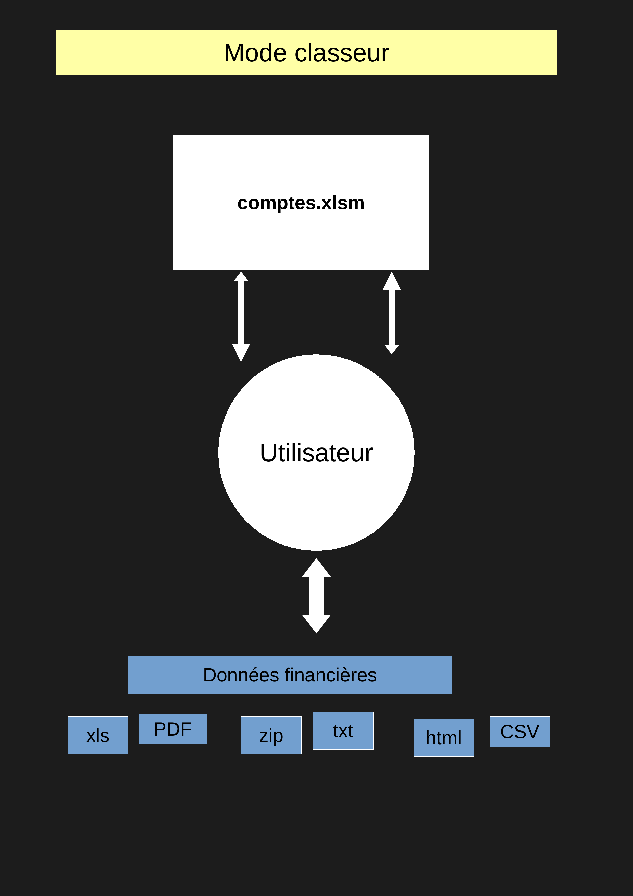
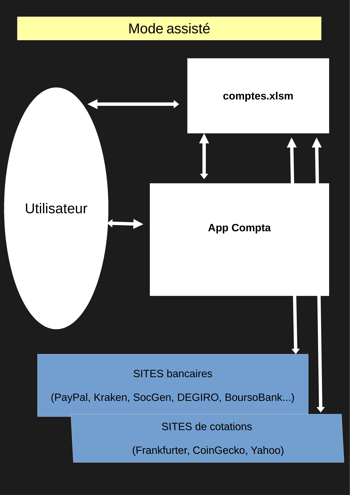
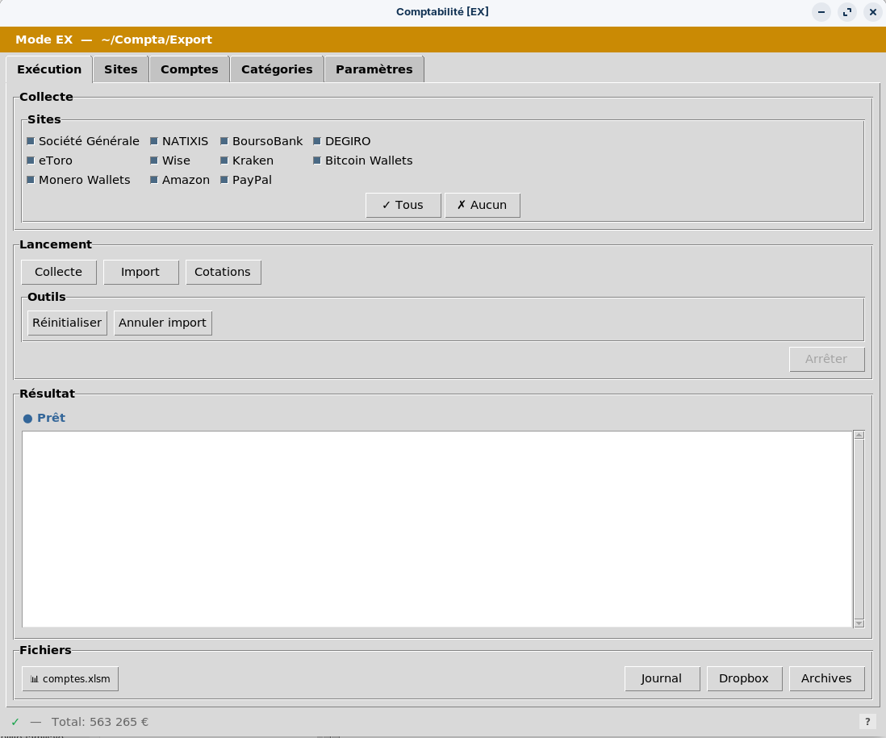

# Compta [EX]

**Comptabilité familiale — classeur Excel + application d'assistance Linux**

## 1. Présentation

Compta est un projet de comptabilité familiale ; il a deux composants :

1. Un **classeur** structuré avec des données brutes et de synthèse
2. Une **application d'assistance** -facultative-  qui
   - contrôle la structure du classeur
   - canalise les données brutes, depuis des sites financiers vers le classeur

### Mode classeur

Le classeur `comptes.xlsm` est utilisable seul, sur Linux, MacOS ou Windows, avec toute application compatible Excel. L'utilisateur importe manuellement les données financières (xls, PDF, zip, txt, html, CSV) et gère lui-même les comptes, devises, catégories, etc.

### Mode assisté

L'application graphique Linux s'intercale entre l'utilisateur et les sites financiers. 

1. Elle collecte, formate et importe les données dans le classeur, depuis les sites financiers
2. Elle permet de gérer sans expertise Excel les éléments comptables du classeur (comptes, catégories, devises, titres) 

Ces deux usages sont indépendants et au choix de l'utilisateur

| Mode classeur | Mode assisté |
|:---:|:---:|
|  |  |

### Capture d'écran



## 2. Fonctionnalités

Le classeur :

- **centralise** dans un format unique les opérations, les avoirs bancaires et biens matériels
- **contrôle** les données saisies, leur cohérence
- présente une feuille **patrimoine**
- présente une feuille **plus/moins-values latentes**
- présente une feuille **budget**

L'application graphique **Comptabilité** automatise :

- **Collecte** des données depuis les sites bancaires et financiers (via Playwright/Chrome)
- **Import** des opérations collectées dans le tableur (déduplication automatique)
- **Catégorisation** automatique des opérations par pattern matching (regex)
- **Appariement** des opérations liées (virements, changes, achats de titres)
- **Cotations** des devises, cryptomonnaies et métaux précieux

et aussi :

- **Configuration** du tableur : création/modification/suppression des comptes, devises, titres, catégories, postes budgétaires
- **Configuration** des paramètres de collecte


## 3. Installation

| Mode classeur | Mode assisté |
|---|---|
| Classeur avec données d'exemple | Classeur vierge + application complète |
| Prérequis : LibreOffice ou équivalent | Prérequis : Linux, LibreOffice |
| Télécharger [`comptes_exemple.xlsx`](comptes_exemple.xlsx)  ; c'est tout ! | Tout télécharger et installer  (*) |


###### (*) Tout télécharger et installer (mode assisté)

```bash
sudo apt install git
git clone https://github.com/mlebas29/Compta.git ~/Compta
cd ~/Compta && ./install.sh
```

> **NB** : Le script `install.sh` installe les dépendances Python, le navigateur Playwright/Chrome, et le raccourci bureau. En cas de prérequis manquant, il indique la commande `apt install` correspondante.

> **NB** : mise à jour ultérieure avec `cd ~/Compta && git pull` 


## 4. Documentation

-  [`Compta.md`](Compta.md)  : concepts et description des données
-  [`Compta_plus.md`](Compta_plus.md) : commandes avancées, dépannage.


## 5. Utilisation — mode classeur

Le classeur d'exemple contient des données fictives à remplacer par les vôtres.

> **Conseils de personnalisation :**
>
> - Renommer les comptes, catégories, devises et titres existants plutôt que les supprimer
> - Supprimer les **lignes d'opérations** (feuille Opérations) librement, en conservant deux lignes #Solde par compte, à des dates différentes
> - Conserver au moins **une ligne par feuille de données** (Opérations, Avoirs, Plus_value, Cotations) pour préserver les formules et le format — les nouvelles lignes se créent par copier/coller d'une ligne existante
> - Modifier avec prudence la structure des feuilles (colonnes, en-têtes, noms définis)
>


## 6. Utilisation — mode assisté

### Sécurité

Les identifiants de connexion sont stockés chiffrés par GPG. Remplir le template `config_credentials.md` puis chiffrer :

```bash
gpg -c config_credentials.md
rm config_credentials.md
```

### Via l'interface graphique

```bash
python3 cpt_gui.py
```

L'interface guide l'utilisateur à travers les étapes : sélection des sites, collecte, import, vérification. Elle peut aussi être utilisée uniquement pour la gestion du classeur (comptes, catégories, devises, titres), sans activer la collecte.

### En ligne de commande

```bash
# Collecte d'un site
python3 cpt_fetch.py SG

# Import des fichiers collectés
python3 cpt_update.py

# Appariement seul
python3 cpt_pair.py

# Mise à jour des cotations
python3 cpt_fetch_quotes.py

# Diagnostics
python3 tool_controles.py -v
```

### Structure du projet

```
cpt_gui.py              # Interface graphique (Tkinter)
cpt.py                  # Orchestrateur général (collecte, import, appariement, cotation)
cpt_fetch.py            # Orchestrateur de collecte
cpt_update.py           # Import des opérations dans Excel
cpt_pair.py             # Appariement des opérations
cpt_fetch_quotes.py     # Mise à jour des cotations

cpt_fetch_SITE.py       # Collecteur par site (Playwright)
cpt_format_SITE.py      # Formatteur par site

inc_*.py                # Modules partagés (Excel, format, fetch, ...)
gui_*.py                # Modules graphiques partagés
config*.json            # Configuration (catégories, comptes, descriptions)
config.ini              # Configuration générale

tool_*.py               # Outils de maintenance
```

## 7. Restrictions

- **Mode classeur** : aucune restriction, fonctionne sur tout OS avec un tableur compatible Excel.
- **Mode assisté** : testé sur Ubuntu 22.04 et dérivés (Zorin, Mint). Le script `install.sh` utilise `apt` et ne supporte pas les distributions non Debian/Ubuntu (Fedora, Arch, openSUSE). Sur ces systèmes, une installation manuelle des dépendances est nécessaire (voir `requirements.txt`).

## 8. Licence

Compta [EX] est distribué gratuitement sous licence GNU GPL v3.

C'est la version export d'un projet conçu pour des extensions de sites.
