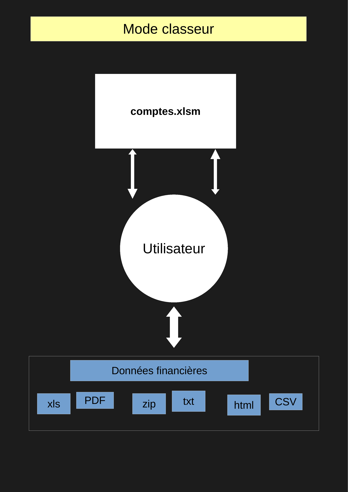
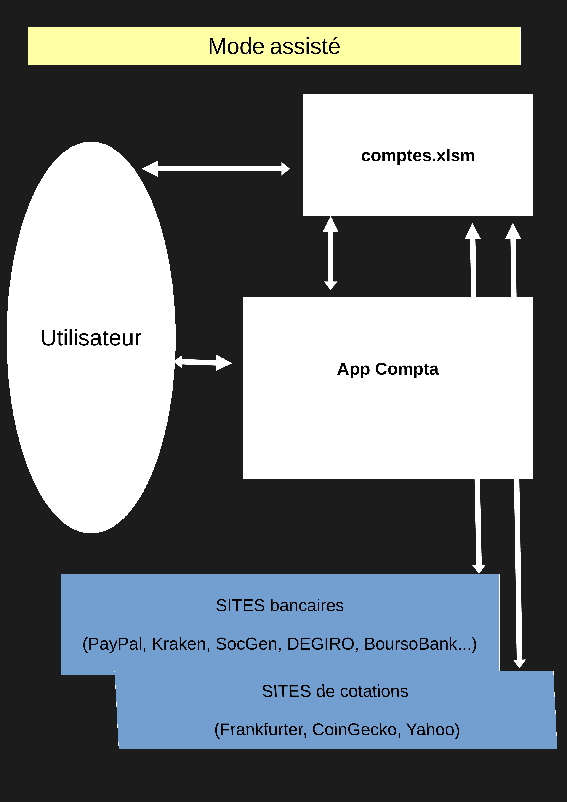
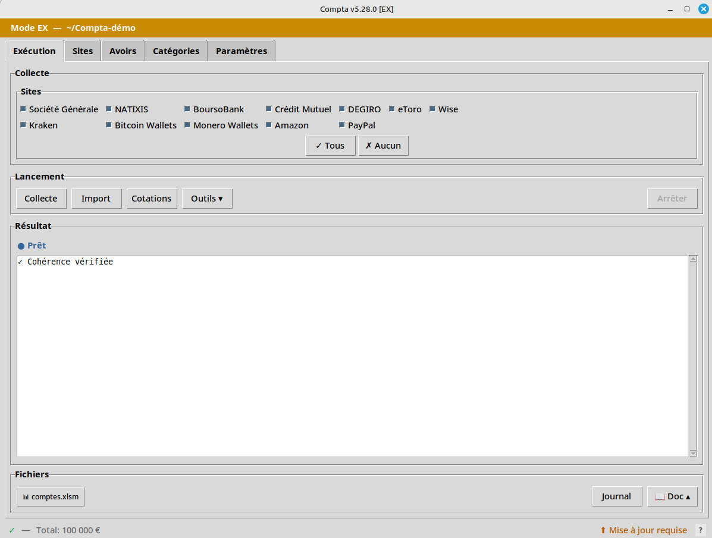

# Compta

**Tout ton patrimoine familial, centralisé et tenu à jour automatiquement — dans un classeur qui reste le tien.**

## 1. Présentation

Compta suit un patrimoine familial **diversifié** (plusieurs banques, titres, crypto, métaux précieux, multi-devises) et lui épargne la saisie manuelle : il **collecte** tes données sur tes sites financiers, les **importe**, les **catégorise** et les **apparie** — pour alimenter des feuilles de synthèse **patrimoine**, **plus-values** et **budget**.

**Tes données ne quittent jamais ta machine.** Tout vit dans un classeur Excel/LibreOffice que *tu* contrôles : ni cloud, ni abonnement, ni service en ligne à qui confier tes finances. Gratuit et open source (GPL v3).

Deux composants :

1. un **classeur** `comptes.xlsm` — tes données brutes **et** leurs synthèses ;
2. une **application d'assistance** (optionnelle) — gère la structure du classeur et collecte depuis les sites.

**Pour qui ?** Une famille dont les avoirs sont assez variés pour que le suivi à la main devienne pénible, et qui préfère **garder la main sur ses données** plutôt que de les confier à une app en ligne.

| Mode classeur | Mode assisté |
|:---:|:---:|
|  |  |

### Mode classeur

Le classeur `comptes.xlsm` est utilisable seul avec toute application compatible Excel. Tu importes manuellement les données financières (xls, PDF, zip, txt, html, CSV) et gères toi-même tes avoirs, comptes, devises, catégories, portefeuilles, etc.

**→ Ce mode convient pour une comptabilité simple, peu diversifiée.**

### Mode assisté

L'application graphique s'intercale entre le classeur et les sites financiers.

Tu peux vouloir une assistance complète ou partielle (soit configuration, soit collecte).

Ce mode supporte les interventions manuelles dans le classeur. Par exemple pour ajouter, supprimer ou modifier des opérations ou des biens. L'important est de conserver les éléments structurants (tableaux, en-têtes, pieds, formules ...)

**→ Ce mode convient pour une comptabilité diversifiée.**

Les environnements supportés sont : **Linux**, **MacOS**, **Windows 11**, dans tous les cas avec **LibreOffice** pour le classeur.

### Capture d'écran



## 2. Fonctions

Le classeur :

- **centralise** dans un format unique les opérations, les avoirs bancaires et biens matériels
- **contrôle** les données saisies, leur cohérence
- présente une feuille **patrimoine**
- présente une feuille **plus/moins-values latentes**
- présente une feuille **budget**

L'application graphique automatise :

- **Collecte** des données depuis les sites bancaires et financiers (via Playwright/Chrome)
- **Import** des opérations collectées dans le tableur (déduplication automatique)
- **Catégorisation** automatique des opérations par pattern matching (regex)
- **Appariement** des opérations liées (virements, changes, achats de titres)
- **Cotations** des devises, cryptomonnaies et métaux précieux

et aussi :

- **Configuration** du tableur : création/modification/suppression des comptes, devises, titres, catégories, postes budgétaires
- **Configuration** des paramètres de collecte

## 3. Installation

|  | Mode classeur | Mode assisté |
|---|:-:|:-:|
| **Prérequis** | Excel ou équivalent (1) | Linux ou MacOS ou Windows 11 |
| **Livré** | Classeur avec données d'exemple | Classeur vierge + application |
| **Action** | Télécharger [`comptes_exemple.xlsx`](https://github.com/mlebas29/Compta/raw/main/comptes_exemple.xlsx) | Tout télécharger et installer (2) |

(1) Doit supporter les nouvelles fonctions XLOOKUP.

(2) En ligne de commande — cloner via `git` puis lancer `install.sh` (idempotent, réutilisable jusqu'à installation complète) :

```bash
sudo apt update && sudo apt install -y git
git clone https://github.com/mlebas29/Compta.git ~/Compta
cd ~/Compta && ./install.sh
# ~/Compta le dossier d'installation peut être nommé autrement
```

`install.sh` installe les dépendances (Python, Playwright/Chrome, raccourci) et LibreOffice ≥ 24.8 ; il signale tout prérequis manquant.

**Détail par système — Linux, macOS, Windows 11 (WSL2) → [`Compta_portage.md`](Compta_portage.md).**

## 4. Mise à jour

Les évolutions sont tracées sur GitHub dans [`CHANGELOG.md`](https://github.com/mlebas29/Compta/blob/main/CHANGELOG.md), qui consigne les changements entre versions.

|                        Mode classeur                         | Mode assisté |
| :----------------------------------------------------------: | :-----------: |
| Télécharger  [`comptes_exemple.xlsx`](https://github.com/mlebas29/Compta/raw/main/comptes_exemple.xlsx) | Depuis l'application (*) |
| Consulter [`Compta_upgrade_classeur.md`](https://github.com/mlebas29/Compta/blob/main/Compta_upgrade_classeur.md) |  |

(*)  **Depuis l'application** au démarrage : quand une nouvelle version est disponible, un indicateur *« Mise à jour »* apparaît ; un clic l'installe et redémarre l'application.

## 5. Documentation

La documentation est organisée autour de deux points d'entrée :

- 📘 **Utilisation** → [`Compta.md`](Compta.md) — guide d'utilisation du mode assisté, et **index de la doc utilisateur**
- 🛠️ **Technique** → [`Compta_dev.md`](Compta_dev.md) — pour les activités de développement

Elle est au format Markdown (`.md`) : lisible sur GitHub, ou localement avec un éditeur Markdown (Typora…).

## 6. Utilisation — mode classeur

Le classeur d'exemple contient des données fictives à remplacer par les tiennes.

**Conseils de personnalisation :**

- Renommer les comptes, catégories, devises et titres existants plutôt que les supprimer ; ceci permet de conserver formules et formats
- Supprimer et ajouter librement les **lignes d'opérations** (feuille Opérations)  en conservant la cohérence avec les lignes #Solde de chaque compte ; a minima avec la plus récente
- Conserver au moins **une ligne par tableau de données** (Opérations, Avoirs, Plus_value, Cotations) pour préserver les formules et le format — les nouvelles lignes se créent par copier/coller d'une ligne existante
- Modifier avec prudence la structure des feuilles (colonnes, en-têtes et pieds de tableaux, formules, noms définis)

## 7. Utilisation — mode assisté

Le classeur livré est **vierge** de données personnelles ou illustratives.

L'application graphique — à lancer via le raccourci installé (icône €) — présente un onglet principal pour la collecte et l'import et des onglets secondaires pour la configuration.

L'app s'utilise également en ligne de commande.

Les identifiants de connexion et leurs mots de passe sites sont stockés dans un fichier chiffré GPG, protégé par un mot de passe maître **P2**.

Pour aller plus loin : **Utilisation** ([`Compta.md`](Compta.md))

## 8. Extensibilité

Il y a plusieurs axes d'extension :

- Le classeur peut être enrichi par d'autres tables ou feuilles (autres présentations de données)

- L'ajout d'un site bancaire peut être intégré au code public ou conservé en partie privée sans toucher au code public.

- Hors les sites, il est possible d'ajouter des "monkeypatch" qui modifient le comportement de l'app sans altérer le code public.

- L'app est livrée avec un environnement de test contenant plusieurs scenarii. Il est lui aussi extensible de manière publique ou privée.

- Le dossier où résident l'application et le classeur peut être cloné pour séparer l'activité développement de l'activité utilisation afin de protéger le classeur.

Pour aller plus loin : **[`Compta_extension.md`](Compta_extension.md)**

## 9. Vérifications

Environnements sur lesquels installation, GUI et collecte sont effectivement vérifiés :

|    Environnement    |   Vérifications   |
| :---------------------------------: | :--------------: |
|       Linux Zorin (Ubuntu 22) et Mint 22 (Ubuntu 24.04)       |     Installation, GUI, Collecte     |
| MacOS Ventura |     Installation, GUI, Collecte     |
|      Windows 11 - WSL/Ubuntu 22      | Installation, GUI, Collecte |

Grâce au système WSL de Microsoft qui simule parfaitement Linux, l'App de base Linux tourne quasiment sans adaptation sur Windows. Pour MacOS, le portage demande plus d'attention en raison d'une architecture différente, bien que cousine pour l'OS, notamment avec LibreOffice et Python.

## 10. Restrictions

Limites connues, valables même lorsque les prérequis sont réunis :

|                  | Mode classeur | Mode assisté                                                 |
| ---------------- | ------------- | ------------------------------------------------------------ |
| **Installation** |               | installation manuelle pour certaines distributions Linux **(1)** |
| **GUI**          |               | **Wayland pur** non supporté **(2)**                        |

**(1)** il s'agit de **Fedora, Arch, openSUSE** et toutes les distributions qui n'utilisent pas l'`apt` Debian/Ubuntu — voir `requirements.txt`.

**(2)** mentionné pour mémoire car Wayland pur (sans XWayland) est quasi inexistant en mainstream Linux. La session Wayland pure casse `xclip` utilisé pour 2FA Kraken/Wise.

La partie GUI fonctionne pour les distributions **Linux Ubuntu** et dérivés (**Zorin, Mint**) - avec **GNOME, KDE, XFCE…** en session **X11** (ou XWayland).

## 11. Signaler un bug

- **Depuis l'application** (si ton installation est configurée pour cela)
- **Sur GitHub** : ouvrir une [Issue](https://github.com/mlebas29/Compta/issues) avec la description du problème et le message d'erreur éventuel — **sans données personnelles** (une issue est publique).
- **En ligne de commande** (nécessite [GitHub CLI](https://cli.github.com/)) :
  ```bash
  gh issue create --title "Bug: description" --body "Détail du problème"
  ```

## 12. Licence

Compta est distribué gratuitement sous licence GNU GPL v3.

## 13. Glossaire

- **2FA** (Two-Factor Authentication) : Authentification à deux facteurs
- **GPG** (GNU Privacy Guard) : Outil de cryptographie au standard OpenPGP
- **GUI** (Graphical User Interface) : Interface graphique
- **P2** : Mot de passe maître de la collecte, saisi au démarrage ; il déchiffre le fichier d'identifiants
- **Playwright** : Outil d'automatisation de navigateur, utilisé pour la collecte
- **WSL** (Windows Subsystem for Linux) : Composant Linux de Microsoft pour Windows

Glossaire complet du projet (vocabulaire métier + sigles) : [`Compta_glossaire.md`](Compta_glossaire.md).
